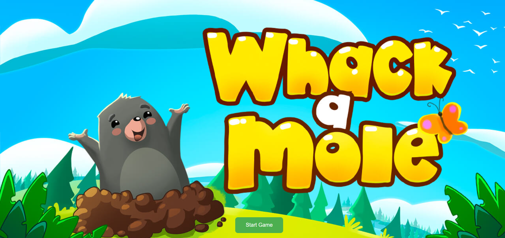
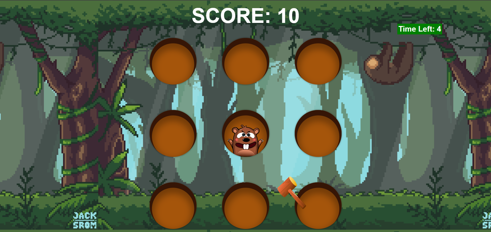
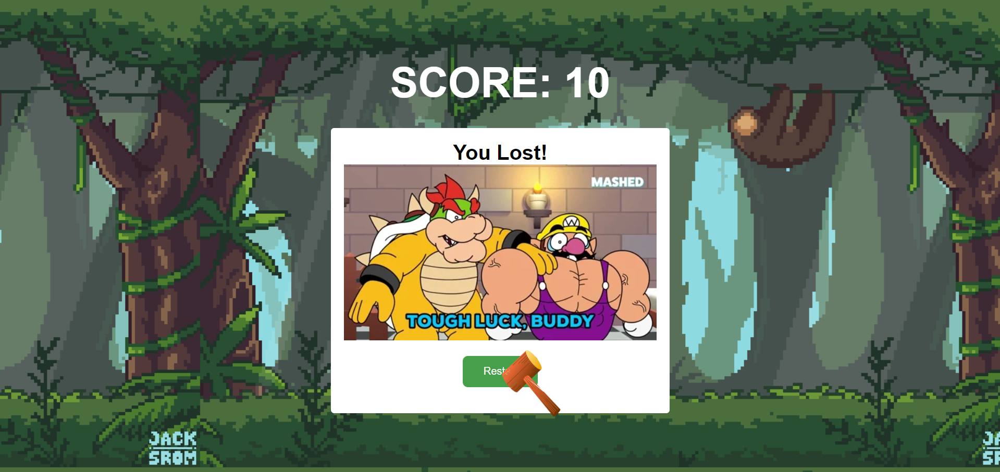

# Whack-a-Mole Game

Whack-a-Mole is a classic arcade game where players use a mallet to hit toy moles that pop up from holes, scoring points for each successful hit. This version of the game is built using HTML, CSS, and JavaScript.

## Features

- Randomly generated moles that appear in different holes
- Scoring system that awards points for each mole hit
- Timer that limits the game duration
- Animated cursor that follows the mouse movement
- Sound effects for mole hits and game results
- Restart button to play again after the game ends

## How to Play

1. Click on the moles that appear in the holes to score points.
2. The game ends when the timer reaches zero.
3. If you score more than 60 points, you win; otherwise, you lose.
4. Click the "Restart" button to play again.

## Demo

You can play the game online at [https://samikshachandel.github.io/Whack-the-mole/](https://samikshachandel.github.io/Whack-the-mole/) .

## Technologies Used

- HTML
- CSS
- JavaScript

## Installation

1. Clone the repository: `git clone https://github.com/your-username/whack-a-mole.git`
2. Open the `index.html` file in your web browser.

## Contributing

If you find any issues or have suggestions for improvements, feel free to create a new issue or submit a pull request.

## Screenshots

Whack-a-Mole Game

